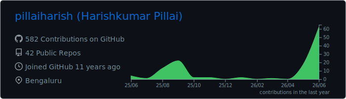
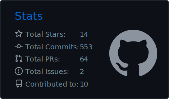
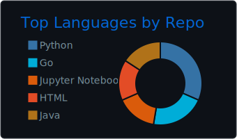

# Harishkumar Pillai

**Backend/security engineer building AI infrastructure, LLM serving labs, local LLM tooling, RAG systems, and agent workflows.**

I build practical systems around local and production-style AI workflows: serving experiments, verification tools, retrieval pipelines, agent orchestration, and backend/security automation. My work sits at the intersection of infrastructure, reliability, security, observability, and developer tooling.

## Featured projects

- [llm-serving-performance-lab](https://github.com/pillaiharish/llm-serving-performance-lab): vLLM serving and benchmarking lab for GPU inference, with TTFT/ITL tracking, concurrency and length sweeps, raw evidence, plots, reports, and clear caveats around what the numbers do and do not prove.
- [chakra-vault](https://github.com/pillaiharish/chakra-vault): Safe local LLM model verification and download tooling focused on SHA-256 checks, safe writes, provider-neutral planning, and restore testing and recovery workflows.
- [opencode-ollama-steroids](https://github.com/pillaiharish/opencode-ollama-steroids): Receipt-first OpenCode + Ollama multi-agent workflow with builder/reviewer agents, validation gates, redaction tooling, local session receipts, and a human commit boundary.
- [harish-llm-wiki](https://github.com/pillaiharish/harish-llm-wiki): Static LLM learning wiki pipeline for transcripts, articles, notes, citation-aware chunks, search, retrieval experiments, and knowledge graph views.
- [LLM-AI-Agents-Learning-Journey](https://github.com/pillaiharish/LLM-AI-Agents-Learning-Journey): Learning and research repo covering LLMs, AI agents, tokenization, AI security, optimization, and hands-on code.

## Current focus

- vLLM benchmarking and serving-performance interpretation
- RTX 5070 Ti local inference experiments
- LLM model backup, verification, and restore tooling
- OpenCode/Ollama agent workflows with review and validation gates
- RAG and knowledge graph systems for personal knowledge workflows

## Technical stack

- Languages: Go, Python, Shell, SQL
- AI/LLM: vLLM, Ollama, llama.cpp, RAG, local LLMs
- Platform: Docker, Kubernetes, GitHub Actions, Jenkins
- Data and observability: Prometheus, Grafana, ClickHouse, MySQL, MongoDB
- Engineering: DNS/security, backend services, CI/CD

## GitHub snapshot

## Writing

I keep a small writing trail on [Medium](https://medium.com/@harishpillai1994), mostly around AI infrastructure, local LLM workflows, Go, Kubernetes, CI/CD, DNS/security, and practical engineering notes.

## Connect

- [LinkedIn](https://www.linkedin.com/in/pillaiharishkumar/)
- [GitHub repositories](https://github.com/pillaiharish?tab=repositories)
